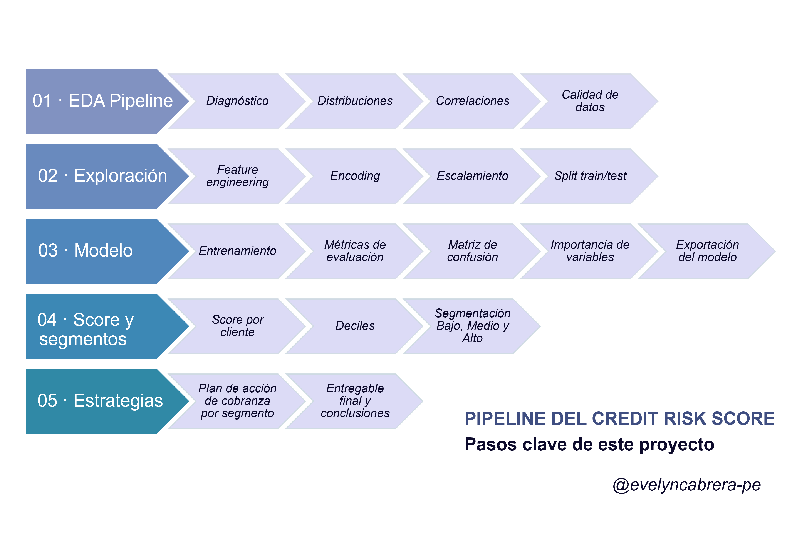

# 02 · Credit Risk Score — Modelo de Scoring de Morosidad


---

## Descripción / Overview

Pipeline completo de scoring crediticio aplicado a un dataset bancario de 10,000 clientes. El proyecto cubre desde el análisis exploratorio hasta la asignación de estrategias de cobranza por segmento de riesgo, replicando el flujo de trabajo real en entidades financieras.

> **Contexto:** En banca, un modelo de score de morosidad permite priorizar la gestión de cobranza, asignar recursos y tomar decisiones basadas en el riesgo real de cada cliente.

---

## Dataset

| Atributo | Detalle |
|---|---|
| Archivo | `dataset_bank_customer.csv` |
| Registros | 10,000 clientes |
| Variables | 16 columnas |
| Variable objetivo | `moroso` (binaria: 0 = buen pagador / 1 = moroso) |
| Tasa de mora | ~20.4% |
| Nulos | Ninguno |

### Variables

| Variable | Tipo | Descripción |
|---|---|---|
| `score_originacion` | Numérica | Score crediticio al momento de apertura |
| `edad` | Numérica | Edad del cliente |
| `ingresos_mensuales` | Numérica | Ingresos mensuales declarados |
| `saldo_promedio` | Numérica | Saldo promedio en cuenta |
| `deuda_total` | Numérica | Deuda total vigente |
| `tenencia` | Numérica | Años como cliente |
| `numero_productos` | Numérica | Productos bancarios activos |
| `tarjeta_credito` | Binaria | Tiene tarjeta de crédito (0/1) |
| `miembro_activo` | Binaria | Cliente activo (0/1) |
| `pais` | Categórica | France / Spain / Germany |
| `sexo` | Categórica | Female / Male |
| `estado_civil` | Categórica | Soltero / Casado / Divorciado / Viudo |
| `segmento_cliente` | Categórica | A / B / C / D |
| `fecha_apertura` | Fecha | Fecha de apertura de cuenta |
| `moroso` | Binaria | **Variable objetivo** |

---

## Estructura del proyecto

```
credit-risk-score/
│
├── data/
│   ├── raw/
│   │   └── dataset_bank_customer.csv
│   └── clean/
│       ├── X_train.csv
│       ├── X_test.csv
│       ├── y_train.csv
│       └── y_test.csv
│
├── notebooks/
│   ├── 01_eda_pipeline.ipynb       ← EDA sobre dataset_bank_customer
│   ├── 02_exploracion.ipynb        ← Ingeniería de features y preparación
│   ├── 03_modelo.ipynb             ← Entrenamiento y evaluación del modelo
│   ├── 04_score_segmentos.ipynb    ← Score, deciles y segmentación de riesgo
│   └── 05_estrategias.ipynb        ← Estrategias de cobranza por segmento
│
├── models/
│   ├── logistic_regression_scoring.pkl
│   ├── scaler.pkl
│   ├── le_sexo.pkl
│   └── features_list.pkl
│
├── outputs/
│   ├── plots/
│   │   ├── 01_missing_heatmap.png
│   │   ├── 01_target_distribution.png
│   │   ├── 01_numeric_distributions.png
│   │   ├── 01_categorical_distributions.png
│   │   ├── 01_correlation_target.png
│   │   ├── 01_boxplots_by_target.png
│   │   ├── 03_model_evaluation.png
│   │   ├── 03_feature_importance.png
│   │   ├── 04_score_segmentos.png
│   │   └── 05_estrategias_cobranza.png
│   └── scores/
│       ├── score_clientes.csv
│       ├── resumen_deciles.csv
│       └── plan_accion_cobranza.csv
│
├── requirements.txt
└── README.md
```

---

## Pipeline del proyecto



## Resultados del modelo

| Métrica | Valor | Interpretación |
|---|---|---|
| AUC-ROC | ≥ 0.75 | Buen poder discriminativo |
| KS Statistic | ≥ 0.20 | Separación aceptable morosos/no morosos |
| Modelo | Regresión Logística | `class_weight='balanced'` por desbalance de clases |

### Segmentación de riesgo

| Segmento | Score | Estrategia | Canal | Frecuencia |
|---|---|---|---|---|
| **Bajo** | 0.00 – 0.30 | Fidelización y cross-sell | Email / App | Mensual |
| **Medio** | 0.30 – 0.60 | Alertas preventivas y refinanciamiento | SMS + llamada | Quincenal |
| **Alto** | 0.60 – 1.00 | Cobranza activa — contacto directo | Llamada + WhatsApp | Semanal |

---

## Cómo ejecutar / How to run

```bash
# 1. Clonar el repositorio
git clone https://github.com/evelyncabrera-pe/credit-risk-score.git
cd credit-risk-score

# 2. Instalar dependencias
pip install -r requirements.txt

# 3. Ejecutar notebooks en orden
jupyter notebook notebooks/
```

> Ejecutar los notebooks en orden: `01` → `02` → `03` → `04` → `05`. Cada notebook genera los archivos que consume el siguiente.

---

## Dependencias

```
pandas>=2.0
numpy>=1.24
scikit-learn>=1.3
matplotlib>=3.7
seaborn>=0.12
scipy>=1.11
joblib>=1.3
openpyxl>=3.1
jupyter>=1.0
```

---

## Sobre este proyecto / About

Este repositorio forma parte del portafolio de datos de **Evelyn Cabrera Arias**, Analytics Translator Senior con más de 10 años de experiencia en banca, riesgo crediticio y cobranza (Interbank · Financiera Oh).

🔗 [linkedin.com/in/evelyn-cabrera](https://linkedin.com/in/evelyn-cabrera) · [github.com/evelyncabrera-pe](https://github.com/evelyncabrera-pe)
